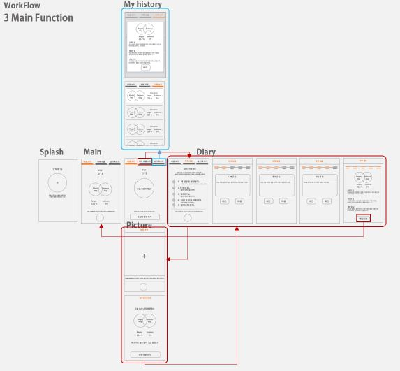
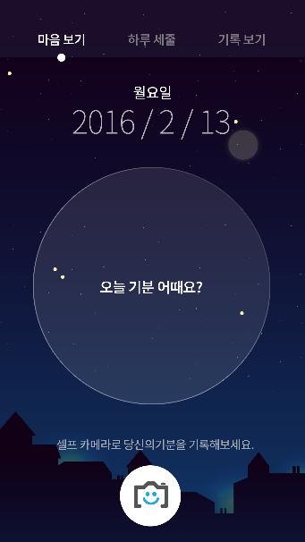
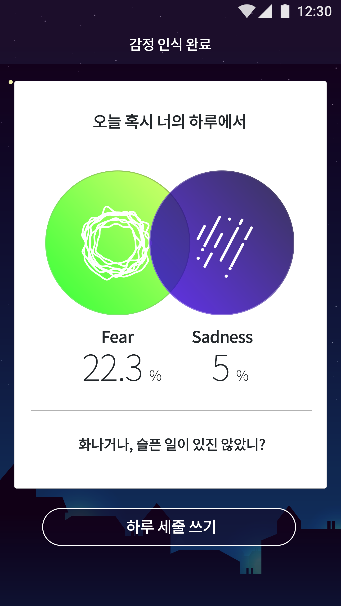
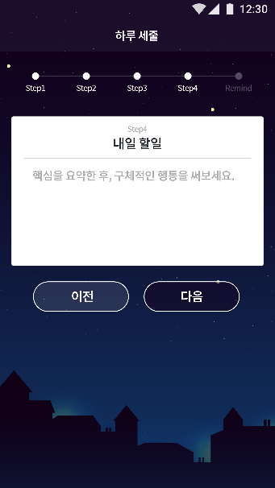
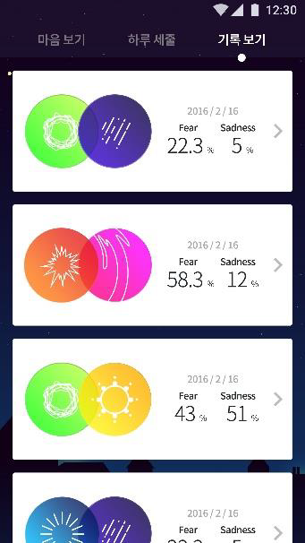

# 제 2회 Unithon
* 2박 3일간 진행된 대학생 연합 해커톤

# 프로젝트 명 : BeforeSleep
* 표정 감정 분석 다이어리 어플리케이션

## 개발 환경
* Android Studio
* Eclipse
* Amazon Web Service
* Microsoft Emotion API

## 프로젝트 선정 배경
* 현대인의 스트레스를 줄일 수 있는 방법으로 잠들기 전 세줄 일기를 통해 마음을 안정시킨다.
 일기를 쓰기전 셀카를 찍고 감정 상태를 알아 봄으로서 좀더 솔직하게 다가갈 수 있도록 한다.

## 프로젝트 설명
* 셀카를 찍은 뒤 표정을 분석하여 감정 출력
* 하루 세줄[나빴던 일, 좋았던 일, 내일 할 일] 간단쓰기 기능
* 세줄 기록과 내 감정을 다시 볼수있는 히스토리 보기 기능

* Work Flow

    

* Emotion API

    

## 미리보기
* 메인 화면

    

* 감정 인식 결과 화면

    

* 일기 작성 화면

    

* 기록 보기 화면

    
